# Battle Win

## Índice

1. [Definição de produto](#definição-de-produto)
2. [Desenvolvimento do projeto](#desenvolvimento-do-projeto)
3. [Histórias de usuários](#histórias-de-usuários)
4. [Interface (UI)](#interface-ui)
5. [Testes unitários](#testes-unitários)

 

---

 

## 📌 Definição de produto

Criamos essa aplicação pensando nos novos usuários do jogo [Pokémon Go](https://pokemongolive.com/en/). Nosso site permite que esses usuários possam buscar pelo pokémon que irá batalhar e ter acesso a informações úteis sobre dele. Ao buscar o rival, o usuário também terá acesso a uma tabela com os monstrinhos que poderá usar na batalha para obter vantagens.

[Confira aqui!](https://karinafs.github.io/battle-win/)

 

---

 

## 👩‍💻 Desenvolvimento do projeto

### ➡️ Planejamento

O planejamento do projeto foi realizado através do Trello.

 

### ➡️ Tema

Escolhemos o tema por uma questão de afinidade com Pokémon e, também, a partir dos dados disponíveis para realizar o projeto.

 

### ➡️ Protopersonas

Criamos as protopersonas baseado em dados de usuários do jogo Pokémon Go e depois adaptamos de acordo com as entrevistas com os usuários reais do jogo. 

#### 🧑 Protopersona 1

  **Huojin "Felipe" Lin**
  _Tímido, engajado, irritadiço_

 Dados demográficos | Comportamentos | Necessidades e objetivos
 --- | --- | --- |
 36 anos | Está fazendo curso de culinária internacional | Aprender inglês
 Filho de imigrantes chineses | É muito apegado com a avó | Arranjar uma namorada que não seja chinesa e se casar
 Mora com os pais e os avós paternos em Guarulhos, SP | Gosta muito de jogos dos consoles portáteis e mais antigos (8-bit) | Fazer um curso de gastronomia na Europa (França ou Itália)
 Trabalha no restaurante dos pais | Pratica caligrafia chinesa | Ter uma carreira de sucesso

 

#### 👩 Protopersona 2

**Fernanda Silva**
_Descontraída, responsável, parceira_

Dados demográficos | Comportamentos | Necessidades e objetivos
--- | --- | ---
25 anos | Jogar vídeo game (RPG) | Adotar um gato
Advogada | Correr e sair com o cachorro para passear | Morar mais próxima do parque da sua cidade
Mora sozinha no Rio de Janeiro| Ler | Ter seu próprio escritório de advocacia 
Formada em Direito | Sair com os amigos | 
Trabalha em um escritório de advocacia | Assistir Netflix | 

 

### ➡️ Entrevistas com jogadores

Realizamos entrevistas com 4 jogadores de Pokémon Go para validarmos as protopersonas e entendermos seus interesses pelo jogo. Colhemos informações pessoais, como: profissão, idade, hobbies, e também realizamos perguntas relacionadas ao jogo, como por exemplo: por que se interessa pela franquia, queixas de usabilidade e o que ajudaria a ter uma experiência melhor. 
Percebemos de forma geral que o maior interesse dos entrevistados é a possibilidade de interagir com outros jogadores, como as [Batalhas de Reides](https://globoesporte.globo.com/esports/noticia/como-batalhar-no-pokemon-go-enfrente-outros-jogadores-no-pvp.ghtml).

 

---

 

## 📄 Histórias de usuários

Com base nas entrevistas, criamos 4 histórias de usuários.

### História 1 | Landing page

> *Como jogador iniciante, quero entrar e ver de cara uma landing page introdutória para entender como a aplicação funciona*

**Critérios de aceitação**
* A landing page deve ter uma imagem bonita e interessante
* Paleta de cores agradável
* Pequeno texto de chamada
* Botão para a ação, que ao ser clicado encaminha o usuário para a próxma seção do site
* A transição de rolagem para a próxima seção deve ser suave

**Definições de pronto**
* Foram incorporados os melhoramentos necessários identificados no teste de usabilidade
* O código tem seus próprios testes e passa neles com, no mínimo, 80%
* O código está de acordo com o guia de estilos
* O código passou por code review
* A história implementada foi testada com pelo menos, 3 usuários
* O código está no GitHub

 

### História 2 | Buscar pokémon rival

> *Como jogador, quero buscar o Pokémon contra o qual irei lutar para ver informações sobre ele que me ajudem nas batalhas*

**Critérios de aceitação**
* Input para digitar o nome do Pokémon
* Botão para buscar o Pokémon
* Card com informações do Pokemon: foto, número, tipo, CP, ataque, defesa, tipos contra qual ele é forte e fraco
* Essas informações aparecem em formato de tabela

**Definição de pronto**
* Foram incorporados os melhoramentos necessários identificados no teste de usabilidade
* O código tem seus próprios testes e passa neles com, no mínimo, 80%
* O código está de acordo com o guia de estilos
* O código passou por code review
* A história implementada foi testada com pelo menos, 3 usuários
* O código está no GitHub

 

### História 3 | Tabela de pokémons vantajosos

> *Como jogador, ao digitar o nome do Pokémon que irei lutar, desejo ver quais são mais fortes contra ele, do mais para o menos forte, para ganhar vantagem na batalha*

**Critérios de aceitação**
* Criar uma função com filtro por tipo e CP para mostrar os Pokémons mais vantajosos
* Os Pokémons apareceram em ordem decrescente por tipo e CP
* Há um dropdown menu para o usuário escolher ordenar os pokémons por maior ataque ou defesa, ordem alfabética crescente ou decrescente dos nomes
* Inserir cálculo agregado mostrando que X% pokémons são do tipo Y e A% dos pokémons são do tipo B

**Definição de pronto**
* Foram incorporados os melhoramentos necessários identificados no teste de usabilidade
* O código tem seus próprios testes e passa neles com, no mínimo, 80%
* O código está de acordo com o guia de estilos
* O código passou por code review
* A história implementada foi testada com pelo menos, 3 usuários
* O código está no GitHub

 

### História 4 | Infos dos melhores pokémons

> *Como jogador, desejo ver os Pokémons mais vantajosos para mim através de uma tabela para conseguir visualizá-los rapidamente e em ordem*

**Critérios de aceitação**
* Os Pokémons apareceram em uma tabela horizontal
* Na tabela aparecerá nome, imagem, tipos do próprio pokémon, tipos contra o qual ele é efetivo, tipos contra o qual ele tem desvantagem, CP, ataque e defesa

**Definição de pronto**
* Foram incorporados os melhoramentos necessários identificados no teste de usabilidade
* O código tem seus próprios testes e passa neles com, no mínimo, 80%
* O código está de acordo com o guia de estilos
* O código passou por code review
* A história implementada foi testada com pelo menos, 3 usuários
* O código está no GitHub

 

---

 

## 🗺️ Interface (UI)

A interface foi melhorada de acordo com o teste de usabilidade. A imagem da primeira página foi pensada no jogo. Clicando no botão `CLIQUE AQUI` o usuário é direcionado para a próxima página onde aparece uma mensagem introdutória e um campo para buscar o pokémon que irá batalhar. Ao clicar no botão `BUSCAR POKÉMON`, aparecerá um card com as informações do Pokémon e, logo abaixo, uma lista em formato de tabela de Pokémons que o usuário poderá usar na batalha para obter vantagem. A lista é baseada no tipo do pokémon que é forte contra qual o usuário irá batalhar. 
É possível ordenar a lista por ordem crescente e decrescente de **Combat Power** e ordenar o nome do Pokémon de **A-Z** e **Z-A**.

 

### ➡️ Responsividade

#### Interface mobile

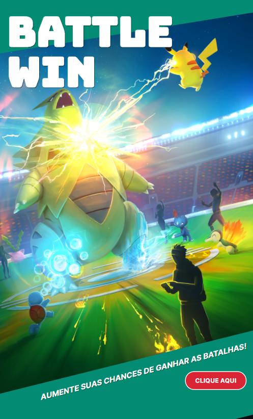 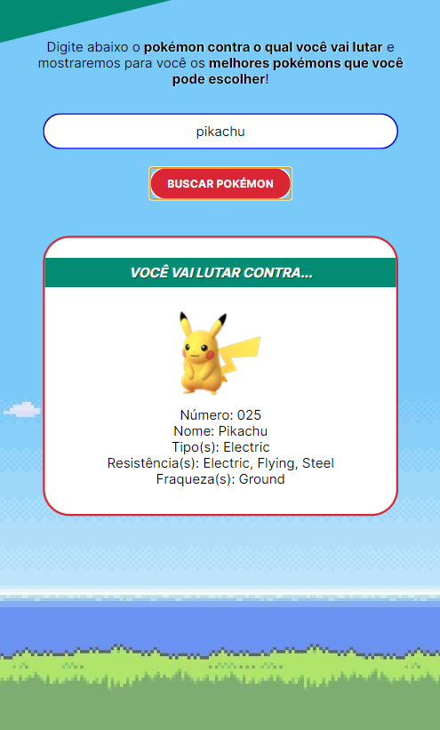 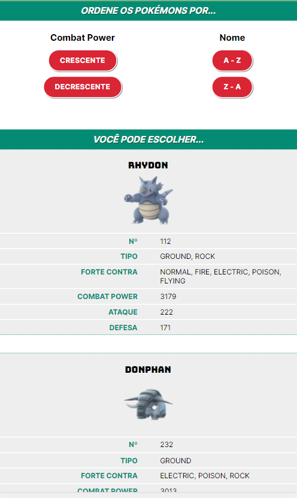

 

#### Interface desktop

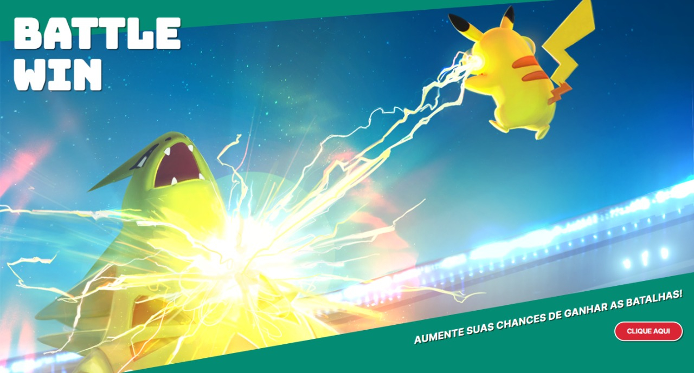 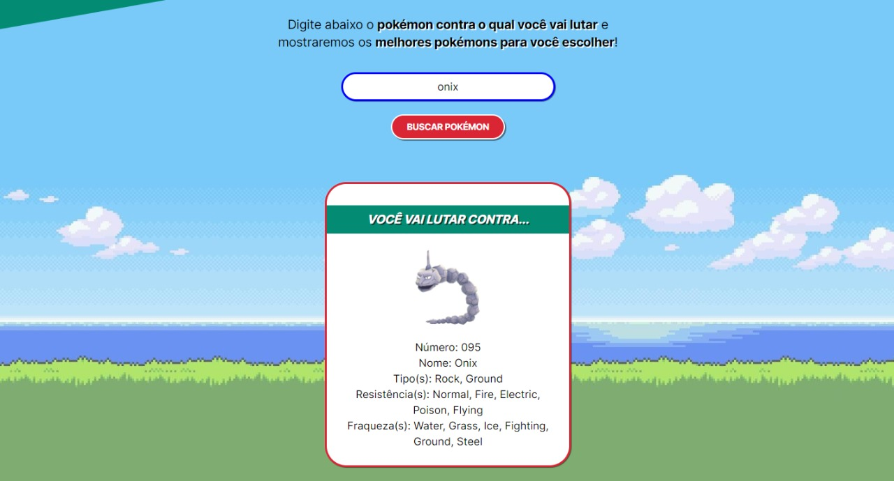 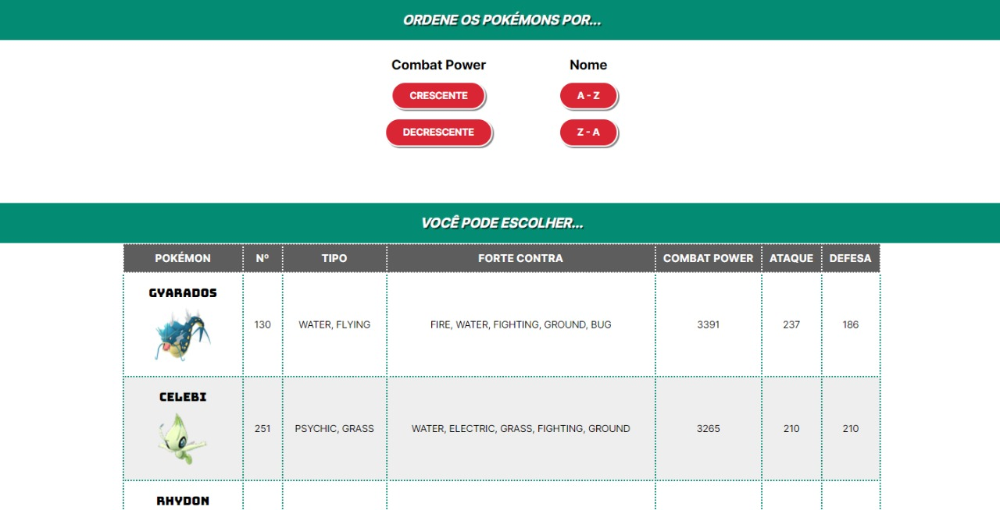

 

### ➡️ Protótipo de baixa fidelidade

Criamos o protótipo da página inicial e da página para o usuário buscar o Pokémon de acordo com as histórias de usuários.

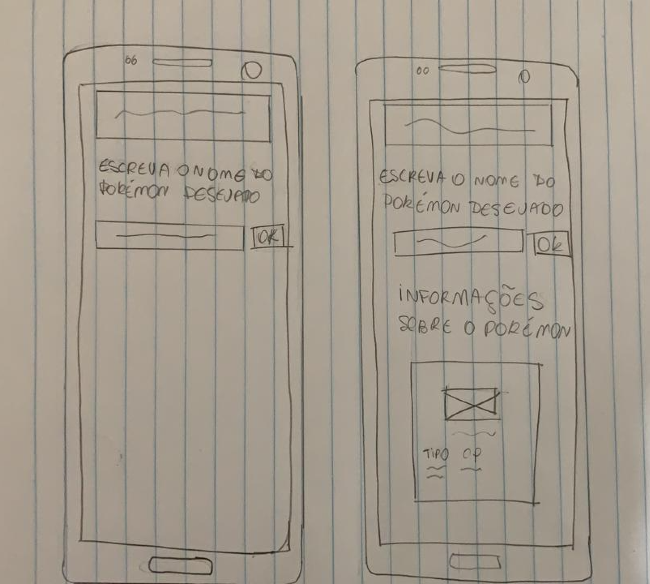
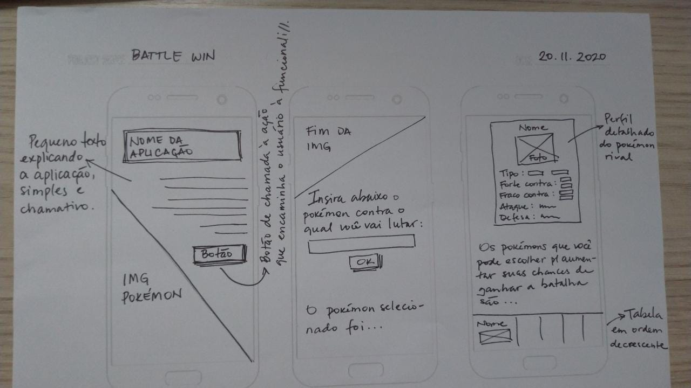

 

### ➡️ Teste de usabilidade

Realizamos os melhoramentos necessários detectados nos testes de usabilidade. Os usuários queriam uma imagem de fundo com mais contexto, e com cores que remetessem mais ao jogo Pokémon Go, e não a jogos mais antigos, como o Pokémon Stadium (para Nintendo 64).
Também solicitaram que ficasse clara a diferença entre o pokémon do card (rival) e os da tabela (os melhores para serem escolhidos), e por isso foram inseridas as tarjas verdes para identificação.

#### Página inicial

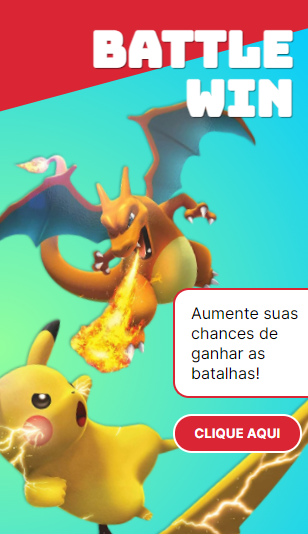
*Primeira versão*

 

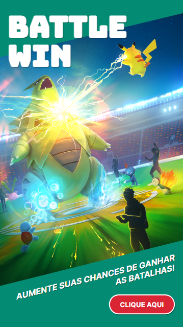
*Versão final*

 

#### Card

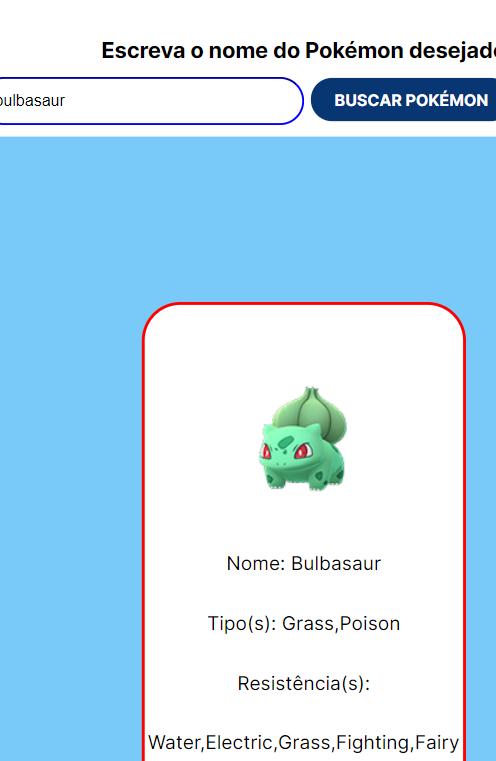
*Primeira versão*

 

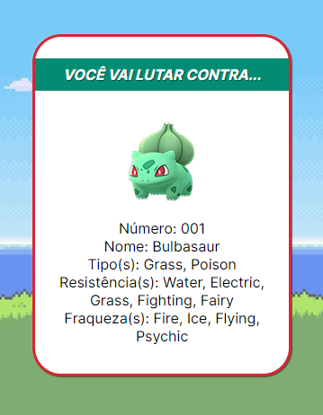
*Versão final*

 

#### Tabela (mobile)

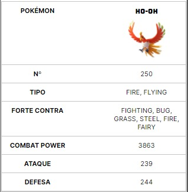
*Primeira versão*

 

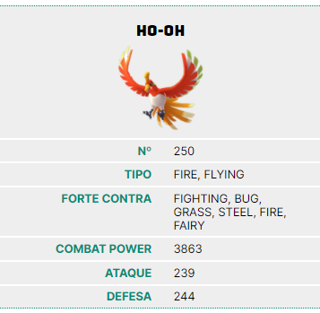
*Versão final*

 

---

 

## 🔨 5. Testes unitários

A aplicação passa em 100% dos testes.

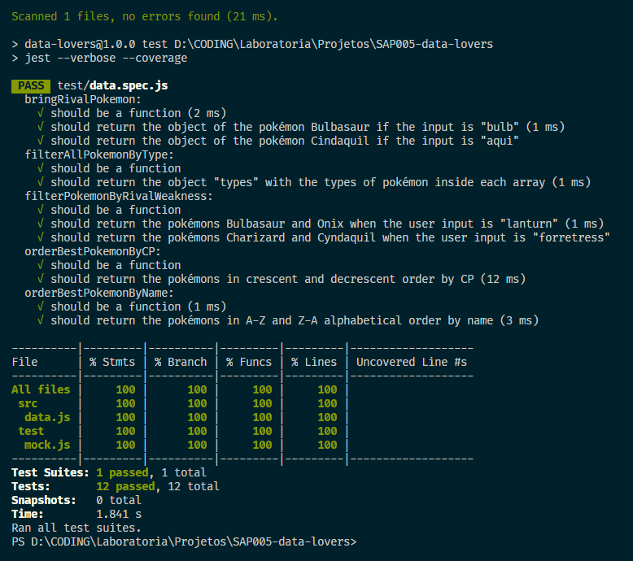

---

Feito com 💛 por [Akemi Mitsueda](https://github.com/akemimeka) e [Karina Santos](https://github.com/KarinaFS) na [Laboratoria](https://www.laboratoria.la/br).

